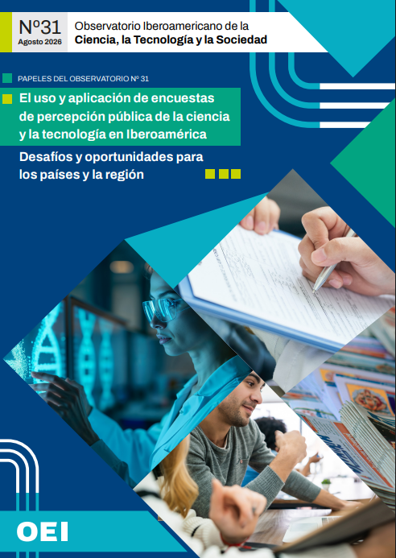

Acá se puede consultar mis publicaciones, informes técnicos, anuarios estadísticos y capítulos de libros desarrollados en el ámbito de ciencia, tecnología y sociedad.

::::: pub-row
::: pub-img

:::

::: pub-text
### El uso y aplicación de encuestas de percepción pública de la ciencia y la tecnología en Iberoamérica

**OEI-JGM · 2026**

Informe sobre el trabajo realizado por representantes miembros de la Red Iberoamericana de Indicadores de Ciencia y Tecnología (RICYT), orientado a la construcción de una agenda para analizar la situación actual y los desafíos futuros de los relevamientos de percepción pública de la ciencia y la tecnología.

[Ver](https://oei.int/wp-content/uploads/2026/08/papeles-31.pdf){.btn .btn-primary .btn-sm role="button" target="_blank"}
:::
:::::

::::: pub-row
::: pub-img

:::

::: pub-text
### Percepción social de la ciencia, la tecnología y la innovación. Análisis de asociaciones espontáneas

**SSCYT-JGM · 2024**

Análisis cuali-cuantitativo de las asociaciones espontáneas de la ciudadanía argentina sobre ciencia, tecnología e innovación, basado en datos de la Encuesta Provincial de Percepción de la CTI.

[Ver](https://www.argentina.gob.ar/sites/default/files/informe_pscti_-_asociaciones_espontaneas.pdf){.btn .btn-primary .btn-sm role="button" target="_blank"}
:::
:::::

::::: pub-row
::: pub-img

:::

::: pub-text
### Informe metodológico: "Asociaciones espontáneas CTI"

**RPubs / SSCYT-JGM · 2024**

Informe metodológico en Quarto del análisis de asociaciones espontáneas de la Encuesta de Percepción de la CTI. Describe el procesamiento de minería de texto y PLN, integra el código en R para garantizar su reproducibilidad y la apertura del dataset utilizado.

[Ver](https://rpubs.com/Valeria_Aguirre/Asociaciones_CTI){.btn .btn-primary .btn-sm role="button" target="_blank"}
:::
:::::

::::: pub-row
::: pub-img

:::

::: pub-text
### Jóvenes y profesiones del futuro. Principales indicadores

**SSCYT-JGM · 2024**

Análisis estadístico e indicadores clave sobre el interés, percepciones y barreras de los jóvenes en Argentina en torno a las disciplinas STEM y las vocaciones científicas tecnológicas.

[Ver](https://www.argentina.gob.ar/sites/default/files/2023/12/indicadores_principales_stem.pdf){.btn .btn-primary .btn-sm role="button" target="_blank"}
:::
:::::

::::: pub-row
::: pub-img

:::

::: pub-text
### Actitud de los jóvenes hacia las profesiones STEM

**DNIC-MINCYT · 2023**

Informe integral de resultados de los principales hallazgos sobre las actitudes, intereses y percepciones de los jóvenes respecto a las disciplinas STEM, analizando los desafíos y oportunidades para la promoción de carreras científicas y tecnológicas en el país.

[Ver](https://www.argentina.gob.ar/sites/default/files/informe_preliminar_jovenes_stem.pdf){.btn .btn-primary .btn-sm role="button" target="_blank"}
:::
:::::

::::: pub-row
::: pub-img

:::

::: pub-text
### Nueva Encuesta de Percepción de la CTI: Indicadores provinciales

**DNIC-MINCYT · 2023**

Inofrme estadístico de resultados sobre percepción pública de la ciencia y la tecnología con enfoque territorial provincial y regional, profundizando en temáticas e indicadores de interés local.

[Ver](https://www.argentina.gob.ar/sites/default/files/2018/05/indicadores_provinciales_percepcion_2023.pdf){.btn .btn-primary .btn-sm role="button" target="_blank"}
:::
:::::

::::: pub-row
::: pub-img

:::

::: pub-text
### ¿Encrucijadas o bifurcaciones biográficas? Transiciones laborales en contexto de pandemia en Argentina

**CLACSO · 2023**

Capítulo del libro en el marco del proyecto de Investigación PISAC-COVID19. Se centró en el impacto social de la pandemia, analiza las transformaciones que generó sobre los cursos de vida laborales, las brechas de género y las estrategias familiares de subsistencia de los trabajadores en distintas regiones del país.

[Ver](https://biblioteca-repositorio.clacso.edu.ar/items/80f79d29-58da-435a-83fd-82f5f2552483){.btn .btn-primary .btn-sm role="button" target="_blank"}
:::
:::::

::::: pub-row
::: pub-img

:::

::: pub-text
### La situación de las mujeres trabajadoras en Ciencia y Tecnología en la Argentina 2009-2018

**DNIC-MINCYT · 2021**

Informe estadístico de la participación de mujeres y varones en el Sistema Nacional de Ciencia y Tecnología argentino en lo que compete al desenvolvimiento de las actividades de investigación y desarrollo (I+D) en el período 2009-2018.

[Ver](https://www.argentina.gob.ar/sites/default/files/2019/06/mujeres_de_cyt_en_argentina.2009-2018.pdf){.btn .btn-primary .btn-sm role="button" target="_blank"}
:::
:::::

::::: pub-row
::: pub-img

:::

::: pub-text
### Indicadores de Ciencia y Tecnología. Argentina 2020

**DNIC-MINCYT · 2021**

Anuario estadístico con los principales indicadores de inversión, recursos humanos y producción científica en I+D correspondientes al año 2020.

[Ver](https://www.argentina.gob.ar/sites/default/files/2018/05/indicadores_2020_web.pdf){.btn .btn-primary .btn-sm role="button" target="_blank"}
:::
:::::

::::: pub-row
::: pub-img

:::

::: pub-text
### Indicadores de Ciencia y Tecnología. Argentina 2019

**DNIC-MINCYT · 2019**

Anuario estadístico nacional con los principales indicadores de inversión, recursos humanos y producción científica en I+D correspondientes al año 2019.

[Ver](https://www.argentina.gob.ar/sites/default/files/2020/12/01_indicadores_2019_v_web.pdf){.btn .btn-warning .btn-sm role="button" target="_blank"}
:::
:::::

::::: pub-row
::: pub-img

:::

::: pub-text
### Percepción pública de la ciencia entre jóvenes. Evolución 2003–2021

**DNIC-MINCYT · 2022**

Análisis longitudinal sobre las actitudes, hábitos informativos y valoraciones de la juventud (18 a 29 años) respecto a la ciencia y la tecnología a lo largo de casi dos décadas. Dimensión institucional.

[Ver](https://www.argentina.gob.ar/sites/default/files/2018/05/percepcion_tematico_jovenes3_final.pdf){.btn .btn-primary .btn-sm role="button" target="_blank"}
:::
:::::
