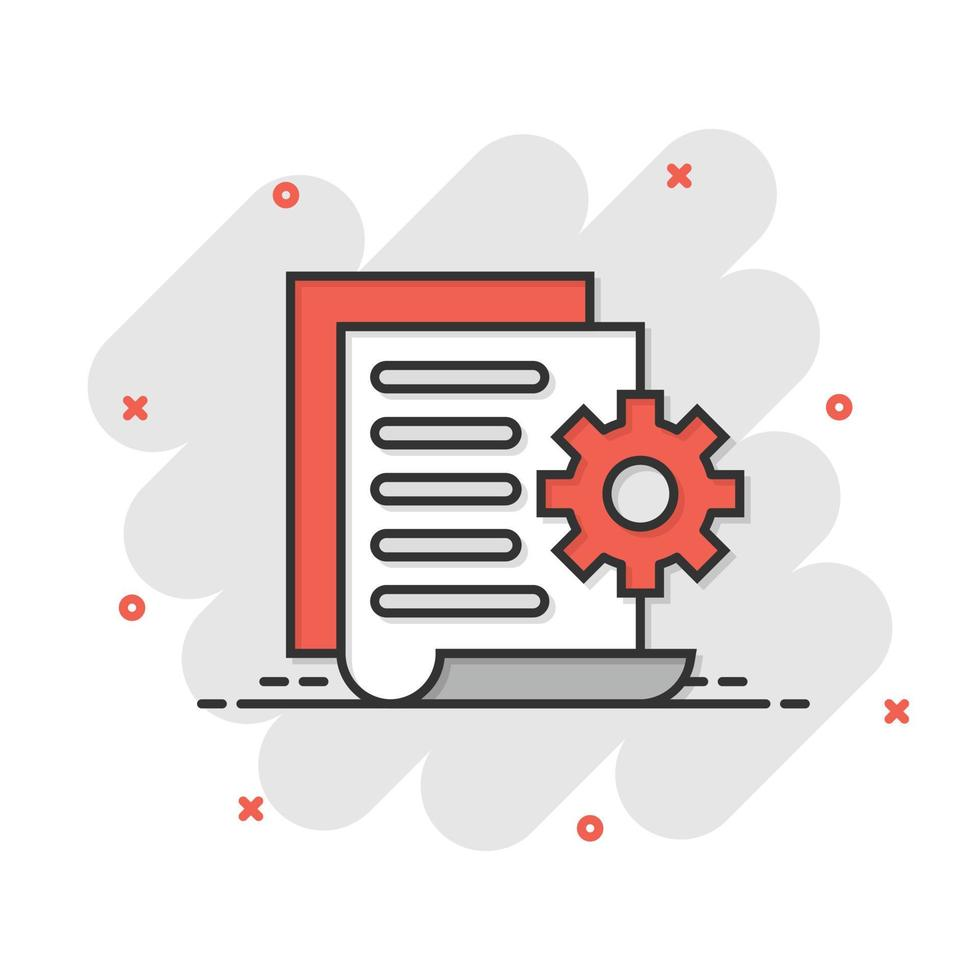
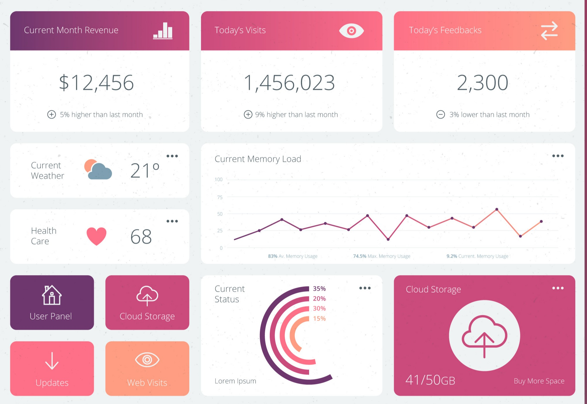
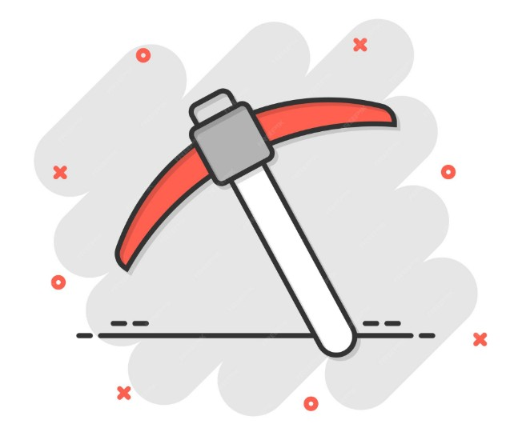

Aquí están algunos de mis proyectos destacados en R:

::::::::::: columns
:::: {.column width="1/3"}
::: card

### Proyecto 1

Análisis de datos cualitativos.
:::
::::

:::: {.column width="1/3"}
::: card

### Proyecto 2

Dashboard interactivo.
:::
::::

:::: {.column width="1/3"}
::: card

### Proyecto 3

Análisis de datos cualitativos con Text Mining.
:::
::::

:::: {.column width="1/3"}
::: card

### Proyecto 4

Procesamiento y limpieza de base de datos.
:::
::::
:::::::::::
